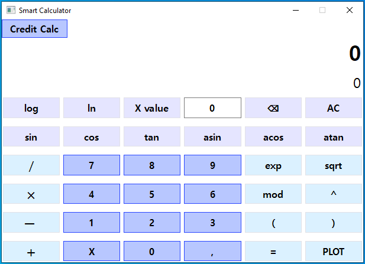

# Smart Calculator

## Description

Stack of technologies used for implementation of this project: **C++, Qt.**

The aim of this project was to create a convenient and yet functional calculator with some special options:

* Calculating arbitrary bracketed arithmetic expressions;
* Plotting a graph of a function given by an expression;
* Special calculations in credit calculator mode.



**Supported Operations**

* Set of simple arithmetic operations **( '*' , '/', '+', '–', 'mod')**;
* Set of trigonometric functions **(sin(), cos(), tan(), etc.)**;
* Set of advanced mathmetical operations **(log(), ln(), square root, exponential notation 'e')**.

**Special options:**

* **PLOT** button to build a plot for given expression
* Substitution if arbitrary value for variable **X**

**Credit Calculator** mode

* Allows user to calculate such credit-related parameters as: **monthly payment, overpayment on credit, total payment** based in input values of **total credit amount, term, interest rate, type (annuity, differentiated)**;
* To compute all the data that interests use 

**Interaction**

* All buttons are clickable, upper line shows output for given expression, bottom line to keep track of input expression;
* To clear input line use **AC** button;
* To enter credit calculator mode make use of **Credit Calc** button in the upper part of window;

**Exceptional situations**

* In case of invalid input you will be warned with corresponding message.


## Build

* To build project call ```make install ``` command, executable file will be located in a freshly-created folder named *build*;

* The project can be opened in Qt Creator environment;
